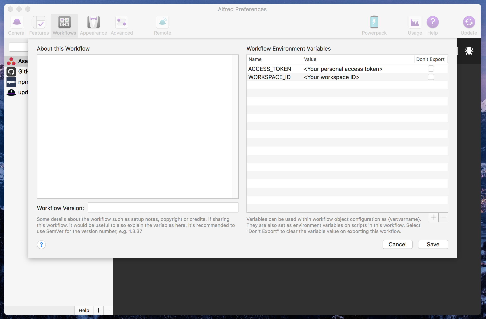

# alfred-asana

> Asana search for Alfred


(powered by [Alfy](https://github.com/sindresorhus/alfy))

## Install

```
$ npm install -g alfred-asana
```

*Requires [Node.js](https://nodejs.org) 4+ and the Alfred [Powerpack](https://www.alfredapp.com/powerpack/).*

In addition you need to set your personal access token and workspace ID, in the workflow environment variables.

- Open Alfred preferences
- Click on the Workflows tab
- Select the Asana workflow
- Open the environment variables panel
- Here is what you should see:


#### How to get your Personal access token

- Make sure you are logged in on Asana and open this link: [My Asana Apps](https://app.asana.com/-/account_api)
- Click on "Manage Developer Apps"
- Click on "+ Create New Personal Access Token"
- Enter a description, for example "Alfred" and click "Create"
- A token should be created, copy it
- Replace `<Your personal access token>` by your token in Alfred environment variables

#### How to get your workspace ID

- Make sure you are logged in on Asana and open this link: [My Workspace IDs](https://app.asana.com/api/1.0/workspaces)
- You should get a list of your workspaces with the names and IDs, copy the workspace you want to use in Alfred
- Replace `<Your workspace ID>` by your workspace ID in Alfred environment variables


## Usage

In Alfred, type `asana`, <kbd>Enter</kbd>, and your query, then you can select the task you want to see with <kbd>Enter</kbd> to open a browser tab on this task, or you can press <kbd>⌘ Cmd</kbd> + <kbd>Enter</kbd> to copy and paste the task URL automatically, convenient when you want to share a link to a task with a colleague.


## Update

To update this workflow to the latest version, use [alfred-updater](https://github.com/SamVerschueren/alfred-updater).

## License

MIT © [Adrien Antoine](http://adriantoine.com)
